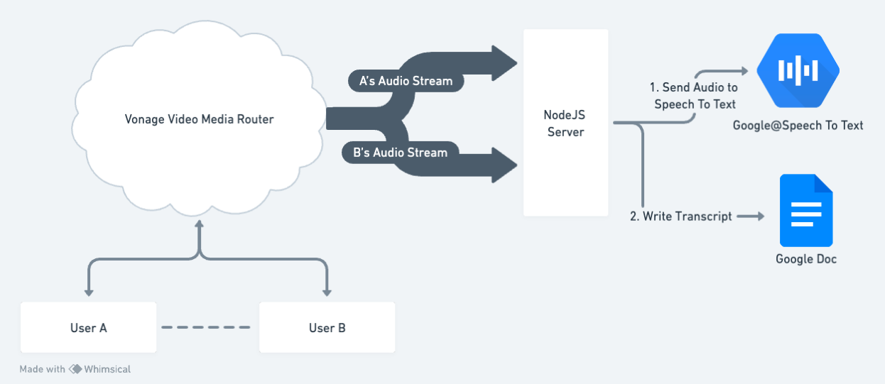

# Vonage Audio Connector with Google Speech-to-Text

## Overview

This project demonstrates the integration of the Vonage Audio Connector with Google's Speech-to-Text service. It captures audio streams, transcribes them in real-time, and writes the transcription results to a Google Doc.

## Table of Contents

- [Prerequisites](#prerequisites)
- [Installation](#installation)
- [Usage](#usage)
- [Demo](#demo)
- [Conclusion](#conclusion)
- [Contributing](#contributing)
- [License](#license)

## Prerequisites

- Node.js and npm installed
- Credentials for Google Cloud services
- OpenTok API key
- ngrok

## Installation

1. Clone this repository:
2. Run npm install
3. Open the tunnel with ngrok
4. Fill the .env

## Architecture

